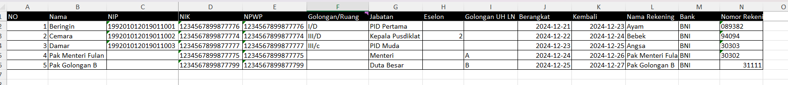

# Setup Kegiatan

langkah-langkah setup kegiatan

1. Buka menu `0. Setup Kegiatan`

   

2. siapkan daftar peserta, klik tombol `Unduh template xls peserta`
3. Sesuaikan dengan peserta kegiatan

   

   - Pastikan semua kolom `NO,Nama,NIP,NIK,NPWP,Golongan/Ruang,Jabatan,Eselon,Golongan UH LN,Berangkat,Kembali,Nama Rekening,Bank, Nomor Rekening` terisi
   - Format kolom `NIP` 18 karakter, tambahkan `'` agar dikenali sebagai text bukan angka contoh `'199201012019011001`
   - Format kolom `NIK` 16 karakter, contoh `'1234567899877799`
   - Format kolom `NPWP` 15 atau 16 karakter, contoh `'1234567899877799`
   - Format kolom `Eselon` adalah `[1,2]` (diisi jika peserta merupakan pejabat eselon 1 atau 2)
   - Format kolom `Golongan UH LN` adalah `[A,B,C,D]` (diisi jika kegiatan dilakukan di LN)
   - Format Golonga/Ruang lihat kolom `R` `Referensi Golongan/Ruang`
   - format kolom `Berangkat,Kembali,` adalah `yyyy-mm-dd` contoh `2024-12-31`

4. isi formulir
   isi formulir dan unggah data dukung yang diperlukan(nodin,jadwal,surat tugas) berupa file `.pdf` dan juga daftar peserta excel `peserta.xls`

   

5. klik submit untuk menyimpan
